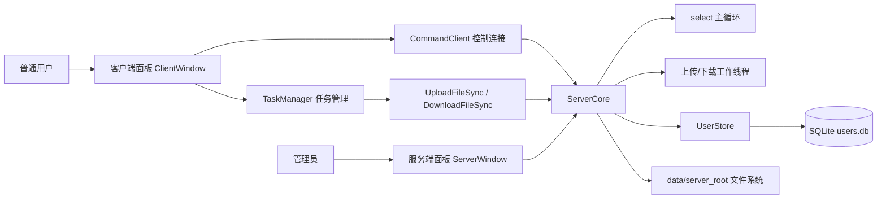
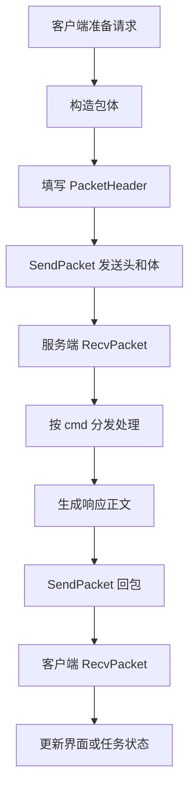
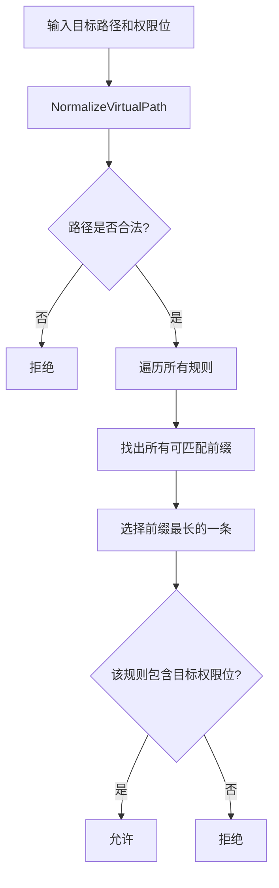
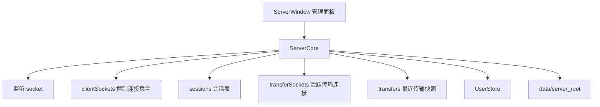
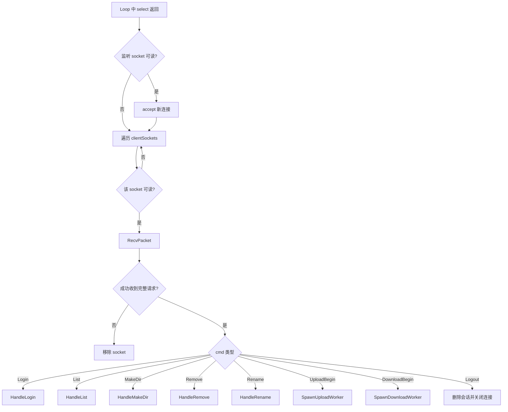
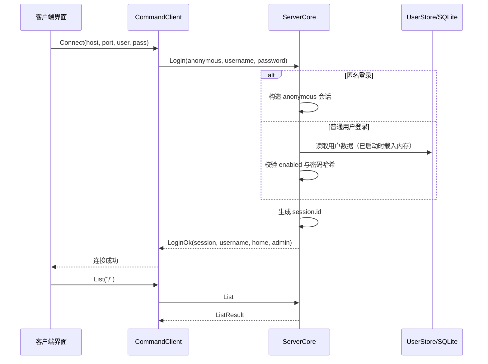
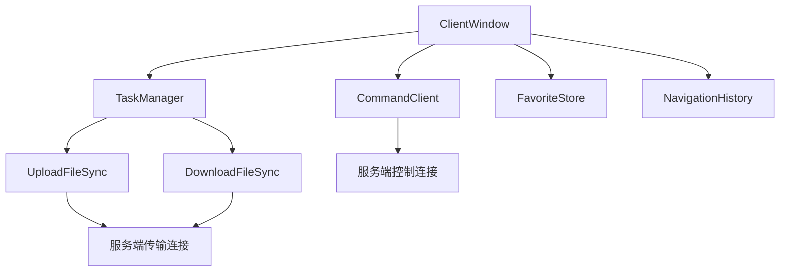
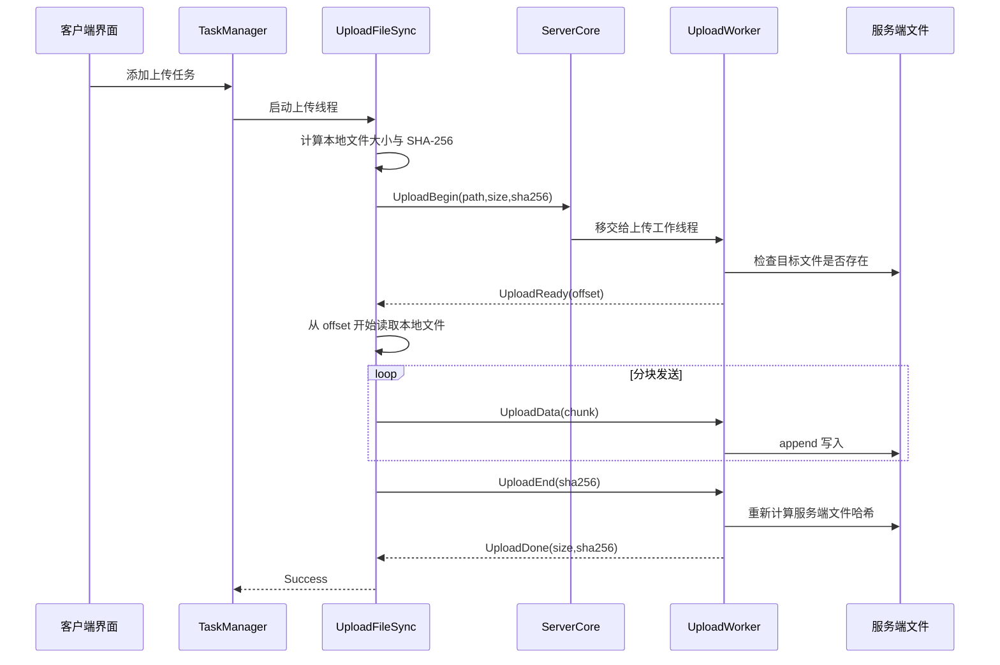
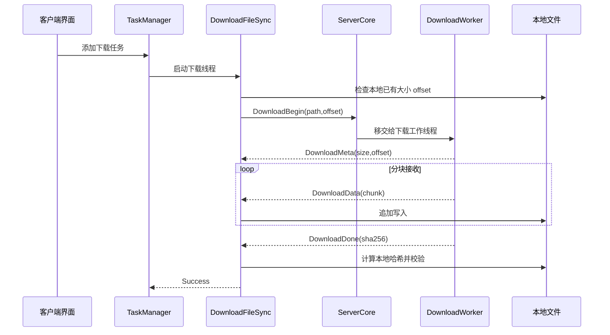

# FDS 项目教程文档

> 面向初学者的详细教程文档。目标是让你在答辩前，能够看懂项目结构、讲清关键业务、理解核心代码，并且能自己把项目跑起来。

---

## 1. 项目简介

### 1.1 项目是做什么的

这个项目是一个基于 `C++ + Win32 GUI + Winsock TCP` 实现的简化版远程文件传输与管理系统。  
你可以把它理解成一个“教学版 FTP 文件系统”：

- 服务端负责监听端口、管理用户、校验权限、读写服务器文件。
- 客户端负责登录、浏览远程目录、上传文件、下载文件、暂停/继续任务。
- 管理员面板负责用户增删改查、权限按钮配置、目录管理、查看传输列表。

它不是一个完整商用 FTP 服务器，但它已经覆盖了一个课程设计/毕业设计里非常核心的内容：

- 网络通信
- 自定义应用层协议
- 图形界面
- 用户系统
- SQLite 持久化
- 文件系统操作
- 权限控制
- 断点续传
- 多任务传输

### 1.2 一句话介绍项目

如果老师问“你的项目是什么”，你可以这样回答：

> 本项目是一个基于 Win32 图形界面和 TCP 自定义协议实现的远程文件传输系统，支持用户登录、目录浏览、文件上传下载、断点续传、权限控制，以及管理员侧的用户与目录管理。

### 1.3 这个项目的亮点

- 协议不是直接用 FTP，而是自己定义了固定包头 + 变长包体。
- 服务端不是单线程死等，而是 `select()` 主循环 + 传输工作线程。
- 上传和下载都支持断点续传。
- 用户数据使用 SQLite 持久化保存。
- 权限不是写死的，而是通过规则字符串和按钮配置实现。
- 客户端和服务端都有图形界面，便于演示和答辩。

---

## 2. 先从整体上理解项目

### 2.1 总体架构图



### 2.2 三层结构怎么理解

整个项目可以分成三层：

| 层次 | 目录 | 作用 |
|---|---|---|
| 共享层 | `src/shared` | 协议、路径处理、权限处理、哈希、socket 工具 |
| 服务端 | `src/server` | 用户管理、会话管理、目录与文件操作、工作线程、管理员面板 |
| 客户端 | `src/client` | 登录、目录浏览、上传下载、任务管理、客户端图形界面 |

### 2.3 为什么这样分层

这样分层有两个很明显的好处：

1. `src/shared` 中的协议和工具函数可以被客户端、服务端同时复用，避免重复实现。
2. 服务端和客户端各自只关注自己的业务逻辑，代码职责更加清晰。

---

## 3. 快速运行项目

### 3.1 运行环境

这个项目面向 Windows 平台，主要依赖：

- Windows
- PowerShell
- `g++` 编译器
- Win32 相关系统库
- SQLite 运行库：`winsqlite3.dll` 或 `sqlite3.dll`

### 3.2 构建命令

在项目根目录执行：

```powershell
powershell -ExecutionPolicy Bypass -File .\build.ps1
```

构建完成后会生成：

- `bin/server.exe`
- `bin/client.exe`

### 3.3 启动方式

启动服务端：

```powershell
.\bin\server.exe
```

启动客户端：

```powershell
.\bin\client.exe
```

### 3.4 默认测试账号

- 管理员：`admin / admin123`
- 普通用户：`demo / demo123`

### 3.5 脚本模式

客户端还支持无界面脚本模式，适合联调和演示：

列目录：

```powershell
.\bin\client.exe --script --host 127.0.0.1 --port 9527 --user demo --pass demo123 --list /public
```

上传文件：

```powershell
.\bin\client.exe --script --host 127.0.0.1 --port 9527 --user demo --pass demo123 `
  --upload-local smoke_upload.txt --upload-remote /upload/demo/smoke_upload.txt --list /upload/demo
```

下载文件：

```powershell
.\bin\client.exe --script --host 127.0.0.1 --port 9527 --user demo --pass demo123 `
  --download-remote /upload/demo/smoke_upload.txt --download-local smoke_download.txt --list /upload/demo
```

---

## 4. 项目目录说明

下面是这个项目最重要的文件和目录：

```text
myFtpPlus/
├─ build.ps1
├─ README.md
├─ bin/
│  ├─ server.exe
│  └─ client.exe
├─ data/
│  ├─ users.db
│  ├─ client_favorites.tsv
│  └─ server_root/
│     ├─ public/
│     ├─ download/
│     ├─ upload/
│     └─ users/
└─ src/
   ├─ shared/
   │  ├─ common.hpp
   │  └─ common.cpp
   ├─ platform/
   │  ├─ win32_util.hpp
   │  └─ win32_util.cpp
   ├─ server/
   │  ├─ main.cpp
   │  ├─ core.hpp
   │  ├─ core.cpp
   │  ├─ user_store.hpp
   │  ├─ user_store.cpp
   │  ├─ window.hpp
   │  └─ window.cpp
   └─ client/
      ├─ main.cpp
      ├─ protocol.hpp
      ├─ protocol.cpp
      ├─ state.hpp
      ├─ state.cpp
      ├─ window.hpp
      └─ window.cpp
```

### 4.1 初学者应该重点看哪些文件

建议按下面顺序阅读：

1. `src/shared/common.hpp`
2. `src/shared/common.cpp`
3. `src/server/core.hpp`
4. `src/server/core.cpp`
5. `src/server/user_store.cpp`
6. `src/client/protocol.hpp`
7. `src/client/protocol.cpp`
8. `src/client/state.hpp`
9. `src/client/state.cpp`
10. `src/server/window.cpp`
11. `src/client/window.cpp`

原因很简单：

- 先看共享层，明白协议和工具。
- 再看服务端，明白“请求怎么被处理”。
- 再看客户端，明白“按钮点击后发生了什么”。
- 最后看 UI，明白整个系统怎么展示给用户。

---

## 5. 数据和目录布局

### 5.1 服务端数据目录

服务端启动时会自动准备下面的目录：

- `/public`
- `/download`
- `/upload`
- `/users`

它们在磁盘上对应 `data/server_root/` 下的真实目录。

### 5.2 默认目录的意义

| 虚拟目录 | 作用 |
|---|---|
| `/public` | 公共可读目录 |
| `/download` | 提供下载资源的公共目录 |
| `/upload` | 用户上传区 |
| `/users` | 用户个人目录 |

### 5.3 用户数据保存在哪里

用户数据保存在：

```text
data/users.db
```

这是 SQLite 数据库文件。  
如果数据库里还没有任何用户，程序会尝试：

1. 先从旧版 `users.tsv` 导入
2. 如果还是空，就创建种子用户

也就是：

- `admin / admin123`
- `demo / demo123`

### 5.4 客户端本地数据

客户端常用连接保存在：

```text
data/client_favorites.tsv
```

这个文件由 `FavoriteStore` 负责读写。

---

## 6. 共享层详解：`src/shared/common.*`

共享层是整个项目最基础的部分。  
如果把项目比作一栋楼，那么 `common.*` 就是地基。

### 6.1 它负责什么

共享层主要负责：

- socket 初始化与封装
- UTF-8 和宽字符转换
- 自定义网络包收发
- SHA-256 哈希
- 虚拟路径规范化
- 权限规则解析
- 目录枚举
- 文本序列化与反序列化

### 6.2 为什么共享层很重要

客户端和服务端如果对协议理解不一致，程序一定会出问题。  
所以最稳妥的做法，就是把协议定义、收发逻辑、公共工具统一放到共享层，双方共同使用。

---

## 7. 自定义协议设计

### 7.1 为什么要自定义协议

TCP 是字节流协议，它只负责把数据从一端送到另一端，但它不知道“哪一段字节是一个完整命令”。  
因此如果你直接连续 `send()` 两次，接收方可能会遇到：

- 粘包
- 拆包

为了解决这个问题，项目设计了“固定长度包头 + 变长包体”的协议。

### 7.2 包头结构

协议头定义在 `PacketHeader`：

| 字段 | 含义 |
|---|---|
| `magic` | 魔数，用于识别是不是本项目协议 |
| `version` | 协议版本 |
| `cmd` | 命令字 |
| `seq` | 序号 |
| `session` | 会话 ID |
| `length` | 包体长度 |

可以把它理解成：

- 先固定读取一个头
- 从头里知道接下来还要读多少字节正文
- 再完整读取包体

### 7.3 协议命令字

项目定义了这些主要命令：

| 命令 | 作用 |
|---|---|
| `Login` / `LoginOk` | 登录 |
| `List` / `ListResult` | 列目录 |
| `MakeDir` | 创建目录 |
| `Remove` | 删除文件或目录 |
| `Rename` | 重命名 |
| `UploadBegin` / `UploadReady` / `UploadData` / `UploadEnd` / `UploadDone` | 上传流程 |
| `DownloadBegin` / `DownloadMeta` / `DownloadData` / `DownloadDone` | 下载流程 |
| `Logout` | 退出登录 |
| `Ping` | 心跳/连通性测试 |

### 7.4 包体格式

这个项目的包体不是 JSON，而是轻量级的“文本行 + 制表符分隔”格式。

#### 键值对正文

例如登录请求正文可以抽象理解为：

```text
anonymous    0
username     demo
password     demo123
```

实际上是按“每行一个键值对”的形式序列化：

- 一行一个字段
- `key` 和 `value` 用 `\t` 分隔
- 行与行之间用 `\n` 分隔

#### 列目录响应正文

目录列表响应不是普通键值对，而是多行记录，第一行通常表示当前目录：

```text
PWD    /public
E      file1.txt    /public/file1.txt    0    128    2026-06-23 10:00:00
E      docs         /public/docs         1    0      2026-06-23 10:05:00
```

其中：

- `PWD` 表示当前目录
- `E` 表示一个目录项

### 7.5 协议流程图



---

## 8. 路径系统设计

### 8.1 什么是虚拟路径

项目里用户看到的是类似下面这种路径：

```text
/public
/upload/demo
/users/demo/report.docx
```

这叫虚拟路径。  
它不是 Windows 上的真实磁盘路径，而是系统对外暴露的逻辑路径。

### 8.2 为什么要用虚拟路径

如果把本地真实路径直接暴露给客户端，会有很多问题：

- 不安全
- 不跨平台
- 不利于权限控制
- 用户容易看到不该看到的目录

因此项目采用了：

- 前端和协议里只传虚拟路径
- 服务端内部再把它转换成真实路径

### 8.3 路径安全是怎么做的

路径处理的关键函数有两个：

- `NormalizeVirtualPath()`
- `VirtualToReal()`

`NormalizeVirtualPath()` 会做这些事情：

- 把 `\` 统一替换为 `/`
- 确保路径以 `/` 开头
- 去掉空段和 `.`
- 遇到 `..` 直接拒绝

这一步非常重要，因为它能防止目录穿越。

例如：

| 输入 | 结果 |
|---|---|
| `public/docs` | `/public/docs` |
| `/public//a/./b` | `/public/a/b` |
| `/public/../secret` | 非法，返回空 |

### 8.4 虚拟路径如何映射到真实路径

`VirtualToReal(root, virtualPath)` 的思路是：

1. 先把虚拟路径规范化
2. 再把路径片段一段一段拼到 `data/server_root` 后面
3. 最后得到真实文件路径

例如：

```text
虚拟路径: /upload/demo/a.txt
真实路径: data/server_root/upload/demo/a.txt
```

---

## 9. 权限模型详解

### 9.1 权限位含义

权限模型用了 4 个权限位：

| 字母 | 含义 |
|---|---|
| `R` | 读权限，浏览目录/下载文件 |
| `W` | 写权限，上传文件/创建目录 |
| `D` | 删除权限 |
| `N` | 重命名权限 |

### 9.2 权限规则字符串

权限规则的格式是：

```text
/path:RWDN;/other:R
```

例如普通用户 `demo` 的默认规则：

```text
/public:R;/download:R;/users/demo:RWDN;/upload/demo:RWDN
```

意思是：

- 能读 `/public`
- 能读 `/download`
- 能完整管理自己的个人目录 `/users/demo`
- 能完整管理自己的上传目录 `/upload/demo`

### 9.3 权限匹配规则

权限判断函数是 `HasPermission()`。  
它采用的是“最长前缀匹配”。

这句话非常重要，你答辩时可以直接说。

意思是：

- 先找所有能匹配当前路径的规则
- 再选“前缀最长、最具体”的那一条
- 用那一条的权限来判断

例如：

```text
/:R
/users/demo:RWDN
```

对 `/users/demo/a.txt` 来说：

- `/` 能匹配
- `/users/demo` 也能匹配
- 后者更长、更具体
- 所以最终用 `/users/demo:RWDN`

### 9.4 权限判定流程图



### 9.5 管理员权限是怎么来的

管理员非常简单，规则直接是：

```text
/:RWDN
```

也就是整个虚拟文件系统都能访问。

---

## 10. 服务端整体设计

服务端的核心类是 `ServerCore`。  
你可以把它理解为“服务端的大脑”。

### 10.1 `ServerCore` 负责什么

它主要负责：

- 监听端口
- 接收客户端连接
- 维护会话 `session`
- 处理登录和普通命令
- 校验权限
- 启动上传/下载工作线程
- 维护传输列表
- 给管理员面板提供数据

### 10.2 服务端模块关系图



### 10.3 服务端启动流程

服务端启动时，核心步骤如下：

1. 构造 `ServerCore`
2. 调用 `EnsureLayout()`
3. 自动创建 `data/server_root` 的默认目录
4. 加载用户数据库
5. 点击“启动服务”后，调用 `Start()`
6. 创建监听 socket
7. 启动 `loopThread_`
8. 在线程里进入 `Loop()`

### 10.4 为什么使用 `select()` 主循环

老师很可能会问：“为什么你这里用 `select()`？”

可以这样回答：

> 因为目录浏览、登录、增删改这些控制命令都比较轻量，适合由一个主循环统一处理；而上传下载是耗时的 I/O 操作，不适合堵塞主循环，所以我把控制流放在 `select()` 主循环中，把长时间传输放到工作线程中处理。

这是一种“控制连接轻量化、传输任务异步化”的设计。

### 10.5 为什么不让上传下载也走主循环

如果上传下载也放进主循环，会出现问题：

- 大文件传输会长时间占用主循环
- 其他用户的登录、列目录请求会被拖慢
- 管理员面板刷新状态也会受影响

所以项目采用：

- 普通命令：`select()` 主循环处理
- 上传/下载：独立工作线程处理

这是一种很适合教学项目的折中方案。

---

## 11. 服务端请求处理主线

### 11.1 主循环在做什么

`ServerCore::Loop()` 每轮大致会做三件事：

1. 监听 `listenSock_`，看有没有新连接
2. 监听已有控制连接，看有没有新请求
3. 把不同命令分发给对应处理函数

### 11.2 请求处理流程图



### 11.3 普通命令有哪些

这些命令都属于“控制命令”，由主循环直接处理：

- 登录
- 列目录
- 创建目录
- 删除
- 重命名
- 注销
- 心跳

### 11.4 传输命令怎么处理

下面两类命令不会在主循环里持续处理：

- `UploadBegin`
- `DownloadBegin`

主循环只负责：

1. 收到这个开始命令
2. 把 socket 从普通控制连接中移交出去
3. 启动对应工作线程

后续这条连接上的文件传输数据，就由工作线程独立处理。

---

## 12. 登录流程详解

### 12.1 登录支持哪两种模式

客户端支持两种登录：

- 普通用户登录
- 匿名登录

匿名登录时：

- 用户名固定视为 `anonymous`
- 主目录固定为 `/public`
- 权限固定为 `/public:R;/download:R`

### 12.2 登录时服务端会做什么

普通登录时，服务端会：

1. 从请求体中取出用户名和密码
2. 查找内存里的用户表
3. 判断用户是否存在、是否启用
4. 把明文密码做 `SHA-256`
5. 与数据库中的密码哈希比较
6. 校验通过后生成新的 `session.id`
7. 把会话保存到 `sessions_`
8. 返回 `LoginOk`

### 12.3 登录时序图



### 12.4 会话 `session` 的作用

登录成功之后，服务端不会每次都重新验证用户名密码，而是通过 `session` 标识当前会话。

这样做的好处：

- 后续请求更轻量
- 服务端能快速知道当前是谁
- 可以把权限、主目录、管理员标志一起存在会话里

---

## 13. 列目录与文件操作流程

### 13.1 列目录做了什么

客户端浏览目录，本质上就是发一个 `List` 命令。

服务端收到后：

1. 先查 `session`
2. 规范化目标路径
3. 如果访问 `/`
   - 管理员看到完整根目录映射
   - 普通用户只看到允许访问的入口快捷方式
4. 如果访问普通目录
   - 先做 `PermRead` 权限校验
   - 再调用目录枚举函数生成列表
5. 返回 `ListResult`

### 13.2 根目录为什么对管理员和普通用户不一样

因为管理员有全局权限，看到的是整个系统结构。  
普通用户没有必要看到所有目录，所以系统只把他有权限访问的入口展示出来。

这样做的优点：

- 更安全
- 界面更干净
- 用户更容易理解自己能操作哪些区域

### 13.3 创建目录、删除、重命名

这三个命令的结构非常类似：

- `MakeDir` 需要 `PermWrite`
- `Remove` 需要 `PermDelete`
- `Rename` 需要 `PermRename`

共同点是：

1. 找会话
2. 解析参数
3. 规范化路径
4. 校验权限
5. 执行文件系统操作
6. 返回 `Ok` 或 `Error`

---

## 14. SQLite 用户存储详解

### 14.1 为什么用 SQLite

SQLite 非常适合这个项目，原因有三点：

1. 不需要额外安装数据库服务
2. 部署简单，只是一个本地文件
3. 对用户表这种轻量数据完全够用

### 14.2 `UserStore` 是怎么工作的

`src/server/user_store.cpp` 的主要逻辑是：

1. 动态加载 `winsqlite3.dll`
2. 如果失败，再尝试 `sqlite3.dll`
3. 打开 `data/users.db`
4. 自动建表
5. 读取 `users` 表
6. 如果表为空
   - 先尝试导入旧 `users.tsv`
   - 再不行就创建默认种子用户

### 14.3 为什么是“动态加载”

这个项目没有在编译期直接强绑定 SQLite，而是运行时通过 `LoadLibraryW()` 和 `GetProcAddress()` 取函数地址。

这样做的好处是：

- 更灵活
- 兼容 `winsqlite3.dll` 和第三方 `sqlite3.dll`
- 对教学项目来说，可以减少构建环境绑定问题

### 14.4 用户表结构

数据库中的用户表包含这些主要字段：

- `username`
- `password_hash`
- `enabled`
- `home`
- `admin`
- `rule_spec`

### 14.5 为什么保存的是密码哈希

服务端并不保存明文密码，而是保存 `SHA-256` 哈希值。  
这比直接存明文更合理，是基础的安全处理。

不过也要客观说明：

- 这里只做了哈希存储
- 网络传输层没有做 TLS 加密

所以这更适合作为教学项目，而不是直接用于公网生产环境。

---

## 15. 客户端整体设计

客户端的核心可以拆成四块：

| 模块 | 作用 |
|---|---|
| `CommandClient` | 维护控制连接，负责登录、列目录、创建目录、删除、重命名 |
| `UploadFileSync` / `DownloadFileSync` | 负责一次具体的上传或下载 |
| `TaskManager` | 负责传输任务生命周期 |
| `ClientWindow` | 图形界面与用户交互 |

### 15.1 客户端架构图



### 15.2 客户端界面包含什么

客户端面板大体上分为：

- 登录区
- 常用连接区
- 当前用户信息
- 当前路径与前进后退
- 文件列表
- 操作按钮
- 任务列表

### 15.3 登录成功后做了什么

客户端登录成功后，`ClientWindow::ConnectServer()` 会继续做三件事：

1. 重置浏览状态
2. 立即浏览 `/`
3. 切换到已登录视图

这就是为什么你登录后会直接看到远程目录列表。

---

## 16. `TaskManager` 任务管理详解

### 16.1 为什么要有任务管理器

上传下载不是瞬间完成的，所以不能让界面按钮点击后一直阻塞。  
因此项目用了 `TaskManager` 来管理任务状态。

### 16.2 一个任务包含哪些状态

任务状态 `TaskState` 包括：

- `Queued`
- `Running`
- `Paused`
- `Completed`
- `Failed`
- `Cancelled`

### 16.3 一个任务里记录了什么

`TransferTask` 里会记录：

- 任务编号
- 上传还是下载
- 本地路径
- 远程路径
- 已传输大小
- 总大小
- 续传起点 `resumeFrom`
- 当前速度
- 状态
- 是否请求暂停
- 是否请求取消
- 文本说明信息

### 16.4 任务是怎么启动的

当用户点击上传或下载时：

1. `ClientWindow::QueueTask()`
2. 调用 `taskManager_.Add()`
3. `Add()` 内部立刻调用 `Start()`
4. `Start()` 开一个线程
5. 在线程里执行上传或下载同步函数

### 16.5 任务进度是怎么更新到界面的

并不是传输线程直接操作界面，而是：

1. 传输线程不断更新 `TransferTask` 的原子变量
2. 客户端窗口定时器每 500ms 调用 `RefreshTasks()`
3. `RefreshTasks()` 把任务快照刷新到列表控件

这种方式简单而稳定，避免了复杂的跨线程 UI 更新。

### 16.6 暂停和取消是怎么做的

这个项目的“暂停”和“取消”不是给服务端额外发一个“Pause”命令，而是通过任务控制标志实现：

- 点击暂停：设置 `pauseWanted = true`
- 点击取消：设置 `cancelWanted = true`

传输循环在每次进度回调时都会检查这两个标志：

- 如果要暂停，当前传输函数返回 `Paused`
- 如果要取消，当前传输函数返回 `Cancelled`

暂停后再次继续，会重新发起连接，并利用断点续传机制继续传。

这是一种“用重连实现继续”的设计。

---

## 17. 上传流程详解

上传是本项目最重要的业务之一。

### 17.1 上传前客户端会先做什么

客户端上传前会先做这些准备：

1. 获取本地文件大小
2. 计算本地文件 `SHA-256`
3. 单独建立一个新的传输连接
4. 发送 `UploadBegin(path, size, sha256)`

### 17.2 服务端收到上传开始请求后会做什么

服务端主循环收到 `UploadBegin` 后，不会自己把整个文件收完，而是：

1. 把 socket 从控制循环中移交出去
2. 启动 `UploadWorker()`

工作线程里再做：

1. 查会话
2. 校验写权限
3. 把虚拟路径转成真实路径
4. 检查目标文件是否已存在
5. 如果已存在，读取它当前大小作为 `offset`
6. 返回 `UploadReady(offset)`

### 17.3 客户端如何继续上传

客户端收到 `offset` 后：

1. 用 `seekg(offset)` 跳过本地文件前面已经传过的部分
2. 从 `offset` 开始继续读
3. 按块发送 `UploadData`
4. 结束时发送 `UploadEnd(sha256)`

### 17.4 服务端如何确认上传完成

服务端收到 `UploadEnd` 后：

1. `flush()` 文件
2. 重新计算服务端文件 `SHA-256`
3. 和客户端最初给的哈希比较
4. 一致则回 `UploadDone`
5. 不一致则返回错误

### 17.5 上传时序图



### 17.6 上传对应的代码阅读路径

建议按这个顺序跟：

1. `ClientWindow::UploadFile()`
2. `ClientWindow::QueueTask()`
3. `TaskManager::Add()`
4. `TaskManager::Start()`
5. `UploadFileSync()`
6. `ServerCore::HandleCommand()`
7. `ServerCore::SpawnUploadWorker()`
8. `ServerCore::UploadWorker()`

---

## 18. 下载流程详解

### 18.1 下载开始前客户端会先做什么

客户端下载前会先检查：

- 本地目标文件是否已经存在
- 如果存在，当前大小是多少

这个已有大小就是下载断点续传里的 `offset`。

### 18.2 下载开始时发什么请求

客户端会建立新的传输连接，然后发送：

```text
DownloadBegin(path, offset)
```

### 18.3 服务端收到后怎么处理

服务端 `DownloadWorker()` 会：

1. 查会话
2. 校验读权限
3. 打开目标文件
4. 读取文件总大小
5. 判断客户端给的 `offset` 是否有效
6. 回 `DownloadMeta(size, offset)`
7. 从该偏移位置开始分块发送 `DownloadData`
8. 最后回 `DownloadDone(sha256)`

### 18.4 客户端如何写本地文件

客户端下载时：

- 如果 `offset == 0`，以截断方式写文件
- 如果 `offset > 0`，以追加方式写文件

所以断点续传的核心不是“记住进度条”，而是“记住文件已经落盘了多少字节”。

### 18.5 下载完成如何校验

客户端下载完后会：

1. 读取 `DownloadDone` 里的服务端哈希
2. 重新计算本地文件哈希
3. 比较两边是否一致

只有一致才算真正完成。

### 18.6 下载时序图



### 18.7 下载对应的代码阅读路径

建议按这个顺序跟：

1. `ClientWindow::DownloadFile()`
2. `ClientWindow::QueueTask()`
3. `TaskManager::Start()`
4. `DownloadFileSync()`
5. `ServerCore::HandleCommand()`
6. `ServerCore::SpawnDownloadWorker()`
7. `ServerCore::DownloadWorker()`

---

## 19. 断点续传到底是怎么实现的

这是答辩里很容易被问到的一点。

### 19.1 先说结论

这个项目的断点续传本质上依赖两件事：

1. 双方都能知道“已经传了多少字节”
2. 重新连接后从这个偏移继续读写

它不是在内存里保存一个复杂的断点对象，而是直接利用文件本身的当前长度来续传。

### 19.2 上传断点续传

上传时断点来自服务端文件大小：

1. 客户端发 `UploadBegin`
2. 服务端看目标文件已经写了多少
3. 服务端回 `UploadReady(offset)`
4. 客户端从本地文件的 `offset` 位置继续读

### 19.3 下载断点续传

下载时断点来自客户端本地文件大小：

1. 客户端看本地文件已写了多少
2. 客户端发 `DownloadBegin(path, offset)`
3. 服务端从这个 `offset` 开始发送剩余内容

### 19.4 为什么暂停后还能继续

因为暂停不是“冻结 socket”，而是：

1. 当前传输线程返回 `Paused`
2. 已经落盘的数据还保留着
3. 再次继续时重新连接
4. 双方重新协商 `offset`
5. 从断点继续

### 19.5 为什么说这种做法简单实用

优点：

- 实现简单
- 容易调试
- 不需要复杂的状态同步协议
- 对课程设计来说非常合适

局限：

- 不能像专业下载器那样做多分片并行
- 断点信息依赖文件现有长度，不适合特别复杂的同步场景

---

## 20. 当前版本对“停服”和“退出登录”的处理

这一部分很重要，因为它直接关系到系统稳定性。

### 20.1 服务端停止服务时为什么要主动中断传输

如果服务端点击停止服务，但传输连接还不断开，就会出现：

- 服务看起来停了
- 文件却还在传
- 状态和实际行为不一致

当前版本已经做了更合理的处理：

1. `ServerCore::Stop()` 先把 `running_` 置为 `false`
2. 对所有活跃传输 socket 调用 `shutdown(SD_BOTH)`
3. 关闭监听 socket
4. 等待传输线程感知断开并收尾

所以现在“停服务”会真正中断文件传输。

### 20.2 为什么客户端有任务时不允许退出登录

如果客户端退出登录，服务端会删除当前 `session`。  
而上传下载任务正在使用这个会话 ID。

一旦登出：

- 正在运行的任务会失去合法会话
- 后续继续任务也会失败

因此当前版本采用了一个更稳妥的设计：

- 当 `TaskManager::HasRunningTasks()` 为真时
- `ClientWindow::Logout()` 会阻止退出登录

你可以把它理解成：

> 为了保证传输任务的连续性，系统不允许在任务还在运行时销毁当前登录会话。

### 20.3 这也是答辩可讲的“设计取舍”

这说明项目不是只追求“功能看起来能跑”，而是开始考虑：

- 会话一致性
- 用户操作边界
- 异步任务与登录状态的关系

---

## 21. 管理员面板详解

### 21.1 管理员面板包含哪些模块

当前服务端面板主要保留了这些核心模块：

1. 服务状态区
2. 用户列表区
3. 用户信息与权限配置区
4. 目录管理区
5. 传输列表区

当前版本没有审计日志模块，界面重点放在“用户、目录、传输”三件核心事情上。

### 21.2 服务状态区

服务状态区能做的事情：

- 设置端口
- 启动服务
- 停止服务
- 查看当前运行状态
- 查看当前连接数与传输数

### 21.3 用户管理区

用户管理支持：

- 新建用户
- 删除用户
- 修改密码
- 启用/禁用用户
- 设置是否为管理员

### 21.4 权限为什么用按钮而不是手写规则

对于初学者和管理员来说，直接手写：

```text
/public:R;/download:R;/users/demo:RWDN
```

可读性并不好，也容易写错。  
所以面板里改成了按钮式配置。

按钮逻辑对应四块区域：

- 公共目录 `/public`
- 下载目录 `/download`
- 用户目录 `/users/<username>`
- 上传目录 `/upload/<username>`

每块区域再配四种权限：

- 读
- 写
- 删
- 改名

### 21.5 按钮最终如何变成权限规则

管理员面板里的 `BuildRuleSpec()` 会把按钮状态拼成规则字符串。

例如某个普通用户选中了：

- `/public` 的 `R`
- `/users/demo` 的 `RWDN`
- `/upload/demo` 的 `RWDN`

最终规则就会变成：

```text
/public:R;/users/demo:RWDN;/upload/demo:RWDN
```

### 21.6 为什么要自动推断 Home 目录

用户登录后需要一个默认进入的主目录。  
管理员面板通过 `SuggestedHome()` 自动推断：

优先级大致是：

1. 用户目录
2. 上传目录
3. 公共目录
4. 下载目录

这样用户登录后能直接进入一个自己有读权限的目录。

### 21.7 目录管理区

管理员面板中的目录管理区支持：

- 查看目录列表
- 进入目录
- 返回上级
- 新建目录
- 重命名
- 删除

这一块不经过普通用户权限规则，而是走服务端专门的管理员目录接口：

- `SnapshotAdminDirectory()`
- `AdminMakeDir()`
- `AdminRename()`
- `AdminRemove()`

### 21.8 传输列表区

传输列表会显示最近传输快照，包括：

- 传输 ID
- 用户名
- 方向
- 路径
- 进度
- 状态
- 说明
- 更新时间

这些数据来自 `ServerCore::SnapshotTransfers()`。

---

## 22. 客户端面板详解

### 22.1 登录区

登录区包含：

- 主机地址
- 端口
- 普通登录 / 匿名登录切换
- 用户名
- 密码
- 常用连接

### 22.2 常用连接怎么保存

点击“保存连接”后，客户端会把：

- host
- port
- user
- anonymous

写到 `data/client_favorites.tsv`。

### 22.3 文件浏览区

文件浏览区的核心交互包括：

- 刷新目录
- 前进/后退
- 上级目录
- 双击进入子目录

路径历史由 `NavigationHistory` 管理。

### 22.4 文件操作区

文件操作区支持：

- 上传文件
- 上传目录
- 下载文件
- 删除
- 新建目录
- 重命名

其中“上传目录”会递归遍历本地目录：

- 本地子目录先在服务端创建对应目录
- 本地文件则转化为多个上传任务加入队列

### 22.5 任务区

任务区支持：

- 暂停
- 继续
- 取消

注意：当前任务列表展示的是

- 任务编号
- 方向
- 本地路径
- 远程路径
- 进度
- 状态
- 说明

而不是传输速度。  
速度值虽然在任务内部仍然有统计，但当前 UI 没有单独展示速度列。

---

## 23. 一次完整上传，从点击按钮到文件落盘

这一节很适合拿去答辩时按步骤讲。

### 23.1 客户端侧步骤

1. 用户点击“上传文件”
2. `ClientWindow::UploadFile()` 弹出文件选择框
3. 选中文件后，生成远程目标路径
4. `QueueTask(true, local, remote)`
5. `TaskManager::Add()` 创建任务
6. `TaskManager::Start()` 开线程
7. 线程调用 `UploadFileSync()`
8. `UploadFileSync()` 计算本地哈希并连接服务端

### 23.2 服务端侧步骤

1. 主循环收到 `UploadBegin`
2. `HandleCommand()` 把它转给 `SpawnUploadWorker()`
3. 工作线程执行 `UploadWorker()`
4. 校验当前会话和写权限
5. 找到真实目标路径
6. 读取已有文件大小，得到续传偏移
7. 回 `UploadReady(offset)`
8. 接收多个 `UploadData`
9. 持续写入服务端文件
10. 收到 `UploadEnd`
11. 重算哈希并比对
12. 回 `UploadDone`

### 23.3 界面如何知道它完成了

上传线程完成后会返回 `TransferResult`。  
`TaskManager` 再把任务状态改成：

- `Completed`
- `Paused`
- `Failed`
- `Cancelled`

随后 UI 定时刷新，就能看到最终状态。

---

## 24. 一次完整下载，从点击按钮到本地生成文件

### 24.1 客户端侧步骤

1. 用户选中一个远程文件
2. 点击“下载文件”
3. 选择本地保存路径
4. `QueueTask(false, local, remote)`
5. `TaskManager::Start()` 开线程
6. 线程调用 `DownloadFileSync()`
7. 检查本地文件已存在大小
8. 带着 `offset` 发起下载

### 24.2 服务端侧步骤

1. 主循环收到 `DownloadBegin`
2. 启动 `DownloadWorker()`
3. 校验会话和读权限
4. 打开服务端文件
5. 返回 `DownloadMeta(size, offset)`
6. 从偏移位置开始发 `DownloadData`
7. 结束后回 `DownloadDone(sha256)`

### 24.3 客户端落盘与校验

客户端下载端会：

1. 以追加或覆盖方式打开本地文件
2. 一边接收一边写入
3. 接收到 `DownloadDone` 后计算本地哈希
4. 与服务端哈希比较

一致才算完成。

---

## 25. 为什么这个项目能让初学者学到很多东西

这个项目很适合作为课程设计的原因，不在于它“代码特别多”，而在于它把很多知识点串起来了。

### 25.1 你能从中学到的核心知识

- 自定义 TCP 应用层协议
- 粘包拆包处理
- 会话管理
- 基础权限系统
- 路径安全
- 文件上传下载
- 断点续传
- 哈希校验
- Win32 GUI 编程
- SQLite 持久化
- 多线程与异步任务

### 25.2 这个项目不是只做界面

很多初学者项目只是把按钮做出来，但核心业务很弱。  
这个项目不一样，它的业务链路比较完整：

- 用户点击按钮
- 触发网络请求
- 服务端做权限校验
- 文件系统实际变化
- 结果回传前端
- 任务状态与界面同步更新

这是一条完整的软件链路。

---

## 26. 建议的代码阅读顺序

如果你时间很紧，建议这样看：

### 第一轮：先看概念

1. `src/shared/common.hpp`
2. `src/server/core.hpp`
3. `src/client/protocol.hpp`
4. `src/client/state.hpp`

目标：

- 知道有哪些类
- 知道协议有哪些命令
- 知道任务状态有哪些

### 第二轮：看核心流程

1. `src/server/core.cpp`
2. `src/client/protocol.cpp`
3. `src/client/state.cpp`

目标：

- 看懂登录
- 看懂目录操作
- 看懂上传
- 看懂下载
- 看懂断点续传

### 第三轮：看界面怎么接业务

1. `src/server/window.cpp`
2. `src/client/window.cpp`

目标：

- 看懂按钮点击后调用了哪个业务函数
- 看懂界面怎样刷新数据

---

## 27. 答辩时可以重点讲的几个设计点

下面这些点是你答辩时最值得讲的。

### 27.1 设计点一：固定包头解决 TCP 粘包拆包

你可以这样说：

> 因为 TCP 是字节流，没有消息边界，所以我设计了固定长度包头，包头里带有正文长度，接收端先收头再收体，这样就能稳定解析每一个应用层请求。

### 27.2 设计点二：控制连接和传输连接分离

你可以这样说：

> 登录、列目录、删除、重命名等属于轻量控制命令，放在 `select()` 主循环里集中处理；上传下载是长时间文件 I/O，单独移交给工作线程，可以避免大文件传输阻塞整个服务端。

### 27.3 设计点三：断点续传基于偏移量

你可以这样说：

> 上传时由服务端告诉客户端当前已接收的字节数，下载时由客户端告诉服务端当前本地已写入的字节数，双方重新连接后从这个偏移继续，因此实现了断点续传。

### 27.4 设计点四：权限使用最长前缀匹配

你可以这样说：

> 权限规则支持多条路径前缀，判定时选择匹配路径中最具体、前缀最长的那条规则，这样既能支持全局权限，也能支持某个子目录更细粒度的授权。

### 27.5 设计点五：管理员面板用按钮配置权限

你可以这样说：

> 为了让权限配置更直观，管理员界面不要求手写规则字符串，而是通过四类目录区域和四类权限按钮组合，后台再自动拼接成规则字符串。

---

## 28. 答辩常见问题与参考回答

### 28.1 为什么用户数据选 SQLite，不选文本文件

参考回答：

> 文本文件虽然简单，但查询、更新、结构化约束都较弱。SQLite 不需要单独部署数据库服务，适合本地轻量持久化，同时比纯文本更规范，便于后续扩展字段。

### 28.2 为什么密码不是明文存储

参考回答：

> 我把密码做了 `SHA-256` 哈希后再保存，避免数据库里直接出现明文密码。这是基础安全措施。

### 28.3 哈希为什么既用于密码，又用于文件

参考回答：

> 两者用途不同。密码哈希用于身份校验，文件哈希用于传输完整性校验，避免上传或下载过程中出现数据损坏而不自知。

### 28.4 为什么暂停不做成单独协议命令

参考回答：

> 当前项目采用的是更简单稳妥的方案：暂停本质上是中断当前连接，继续时重新建立连接并依据文件已有大小续传。这样协议更简单，代码更容易维护，也足够满足教学项目需求。

### 28.5 为什么服务端停服后传输也要停

参考回答：

> 因为“停止服务”意味着系统不再接受和维持业务传输，所以当前版本会主动关闭活跃传输连接，保证界面状态和实际行为一致，同时也避免停服后后台线程还继续写文件。

### 28.6 为什么有任务时不允许退出登录

参考回答：

> 因为运行中的任务依赖当前会话 ID，如果先登出，会话失效，任务就会处于不一致状态。为了保证传输稳定性，当前版本禁止在有运行中任务时直接退出登录。

---

## 29. 项目的不足与可改进方向

答辩时主动说一点不足，通常会加分，因为说明你理解得比较完整。

### 29.1 当前不足

- 登录密码虽然做了哈希存储，但传输层没有 TLS 加密
- 传输线程采用简单的 `detach` 模式，没有线程池
- 权限模型是按路径前缀匹配，还不是更细的 ACL
- 断点续传只支持单连接单偏移，不支持多分片并行
- 目前没有审计日志模块

### 29.2 可以继续优化的方向

- 增加 TLS 或至少做更安全的认证交换
- 加入线程池或任务队列
- 增加上传下载速率限制
- 增加文件秒传或增量校验
- 增加审计日志和操作追踪
- 增加更复杂的角色权限模型

---

## 30. 最后总结

如果你只记住三句话，可以记这三句：

1. 这个项目本质上是“自定义协议 + 远程文件系统 + 图形化管理”的教学版 FTP 系统。
2. 服务端采用 `select()` 处理轻量控制命令，采用工作线程处理耗时传输，因此兼顾了结构清晰和实现难度。
3. 断点续传的核心不是“进度条”，而是“基于文件已有长度协商偏移量，再从偏移继续读写”。

如果你按本文顺序再结合代码走一遍，已经足够支持一次比较完整的课程答辩。

